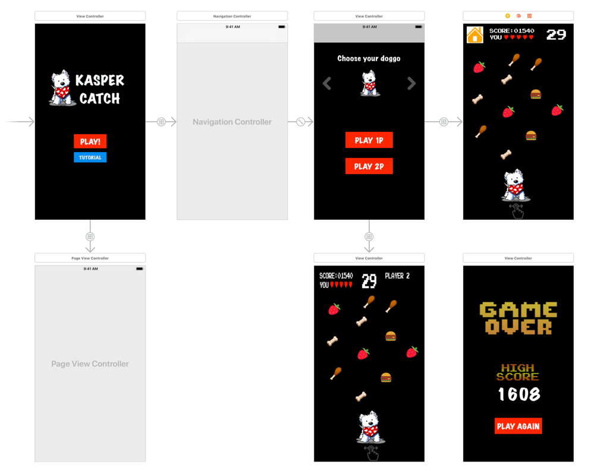

Kasper Catch

1. **App Definition Statement**

Kasper Catch is an interactive game app targeted but not limited to users who own dogs to learn what their dogs can eat and what they can't by playing the game and earning points as they "eat" the correct item by sliding across the screen as the items rain from the top of the screen. Users have three lives before they eat the wrong items and kill their dog causing game over. There will be a tutorial and list of items that they can eat what that they should avoid. Best score and total score will be displayed when user loses the game, with option to go back to home page or play the game again. And to make it more social, you can play against users nearby you, compete under time constraint and see who knows dog’s diet better!

1. **App Proposal**

As shown in the image below, the application will start on a view controller “Home”, displaying the title and two buttons, one to start playing the game and the other to watch the tutorial that will contain information and instructions about the game displayed in a page view controller. Upon reaching the end of the tutorial, user will have the option to go back home and press play to start playing the game. When pressing Play button, a new view controller will be shown, unlike the tutorial, this will be using navigation controller so it provides the user to go back to Home.

Pressing on Play will display to the user the option of personalizing the dog breed that they desire for the game, followed by two playing options: 1P or 2P. 1P and 2P has the same idea, which consists of dragging the doggo across the screen catching the correct items to earn points, the difference is that 1P provides 5 lives for the user to play and earn points before losing all lives and ending the game; the items will fall faster as the user score is higher, making the game more difficult. Unlike 2P, the idea of this mode is playing against opponent and catching as many correct items as possible under 1 minute countdown, catching wrong item will result in score reduction. 2P will be available through server and detecting nearby users, if not available then it will return to no users nearby to play against.

Another idea of playing with 2P is using Apple’s Game Center to play against other users who are also connected through game center. A pop up to login/connect to game center will be shown to ask for user’s permission when running the game for the first time. The two type of playing modes will be through a view controller, and using gestures to detect user’s dragging across the screen.

When the game ends, another view controller will be shown to display that the game is over and the score obtained, along with a small number on the corner displaying the user’s highest score of all time for the 1P mode, and showing both the score of the user and the opponent’s score, then displaying if the user and opponent if they lost or won respectively for the 2P mode. As the user beats its highest score, the new score will update the high score and that will just be store in a variable. For both modes, a “Play Again” button and “Home” button will be displayed to allow user to play again or go back to home page to choose playing mode.

The game scene is intended to use SpriteKit if allowed, else will all be done programmatically using UIDynamics library to let the items fall from top of the screen to the bottom as user catch it, and then Gesture recognizer to detect if the item is inside the bounds of the doggo. Animations will be added as well as background music and sound effects, but these can be disabled in “Home”.

Special feature will be allowing the user to upload an image of their dog and cropping it to make it be the character of the game, or even better provide a view controller that allows the user to design their own dog icon to be used in the game.

1. **Game Storyboard**

